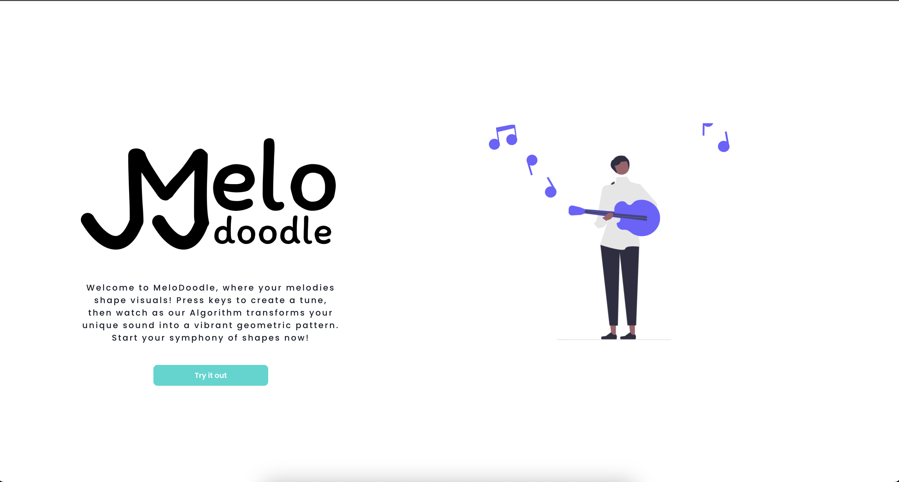

# MeloDoodle

## Overview

    MeloDoodle is a creative project that lets users record an audio clip and transform it into an eye-catching visual pattern. This web application leverages the power of digital signal processing and geometry to generate unique and personalized SVG visualizations.

## Technologies Used

    - React
    - TypeScript
    - Chakra UI
    - Tone.js
    - D3.js

## Features

    The application offers two main functionalities:

    - Audio Recording: Users can record a tune for a certain duration directly within the application. Whether it's a hum, a song, or an ambient noise, any sound can be the starting point for a visual creation.

    - Pattern Generation: Once the audio clip is recorded, the application processes the audio data and converts it into an attractive and simple pattern. This transformation is based on an algorithm that translates audio frequency and duration data into a polar coordinate system, with additional geometric transformations applied to create a compelling visual output.

## How it Works

    The algorithm maps each note played in the audio clip to a sine waveform, representative of the frequency of the note. The amplitude and phase of the waveform are then translated into a polar coordinate system, creating a circular pattern that mirrors the periodic nature of the audio signal. We then apply a duration-based filter that highlights the points corresponding to longer-lasting notes, adding another dimension to the visual output. Lastly, a convex hull wraps around the outermost points to form a boundary around the shape created by the audio.

    The final result is a unique and interesting visual representation of the audio clip, showcasing how music and sound can be translated into visual form.

## License

    MeloDoodle is licensed under the MIT License.
